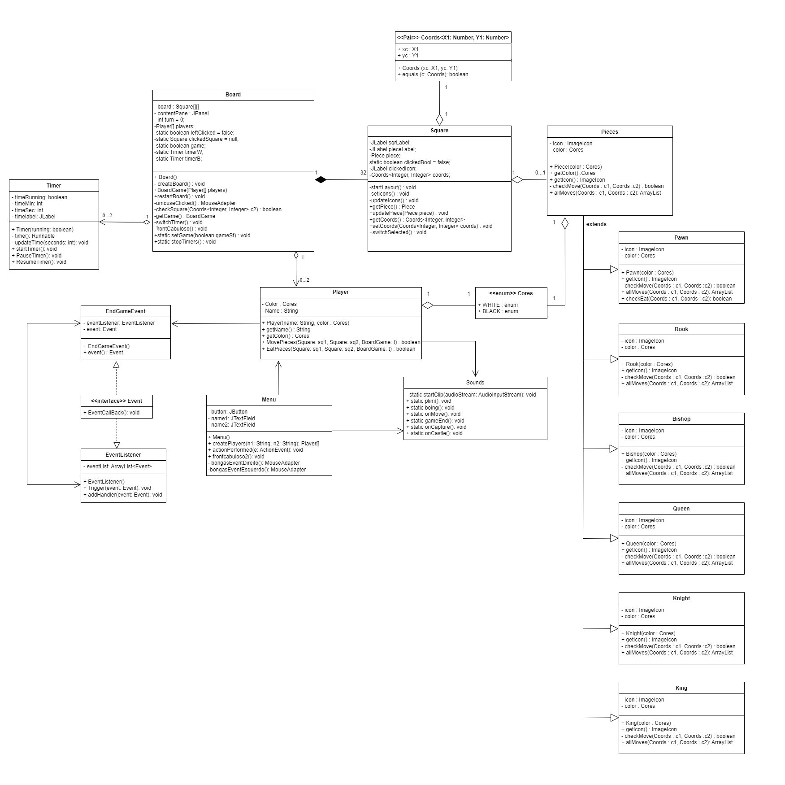

# BongasChess

### Greetings and welcome to Bongas Chess!

This is a Java-based chess game developed as part of the Object Oriented Programming (OOP) discipline of the Computer Engineering course at Senai Cimatec, guided by Professor Marcos Soussa.

##

Developed by:

- _[Daniel Vasconcelos](https://github.com/danbasco)_
- _[André Rezende](https://github.com/Andre-D-Rez)_
- _[Guilherme Rios](https://github.com/guilhermerios21)_
- _[Arthur Gouveia](https://github.com/ArtsGG)_

## UML

